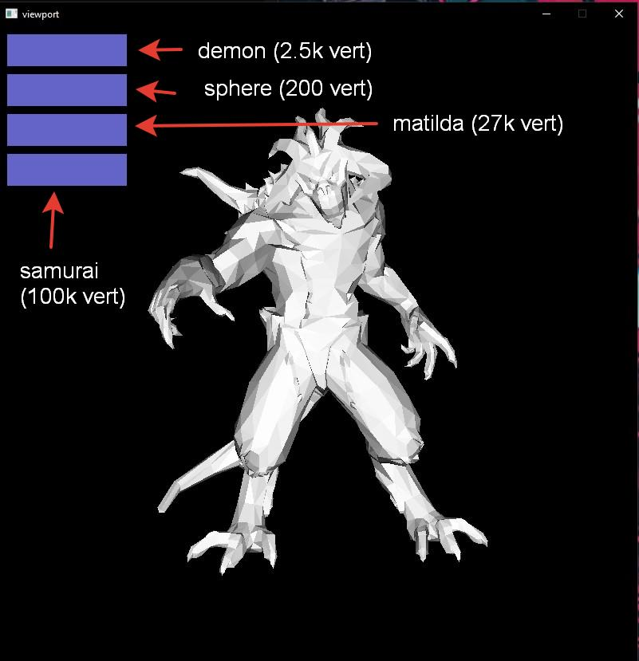
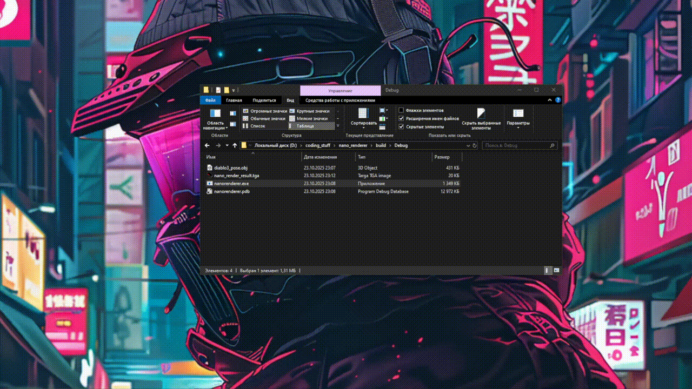
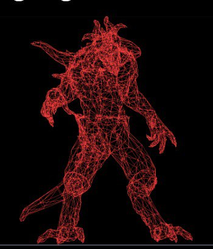
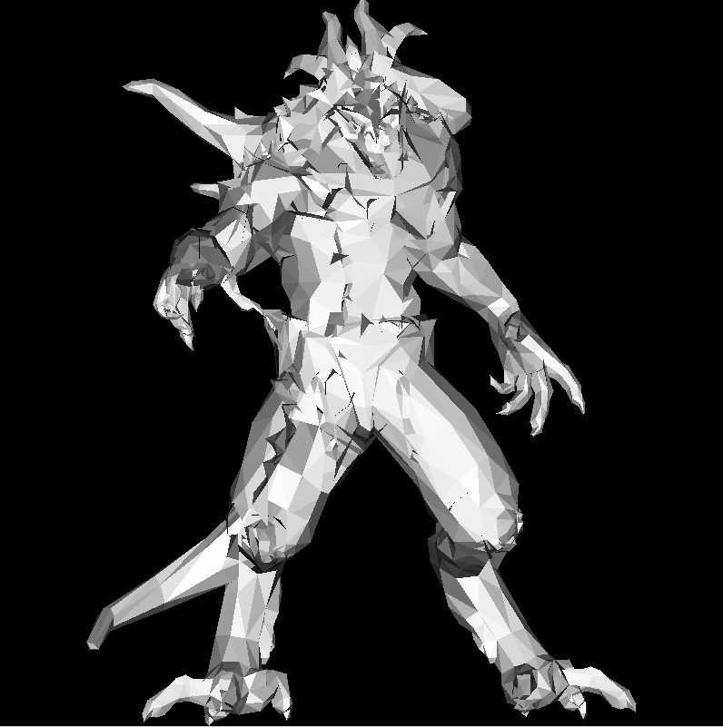
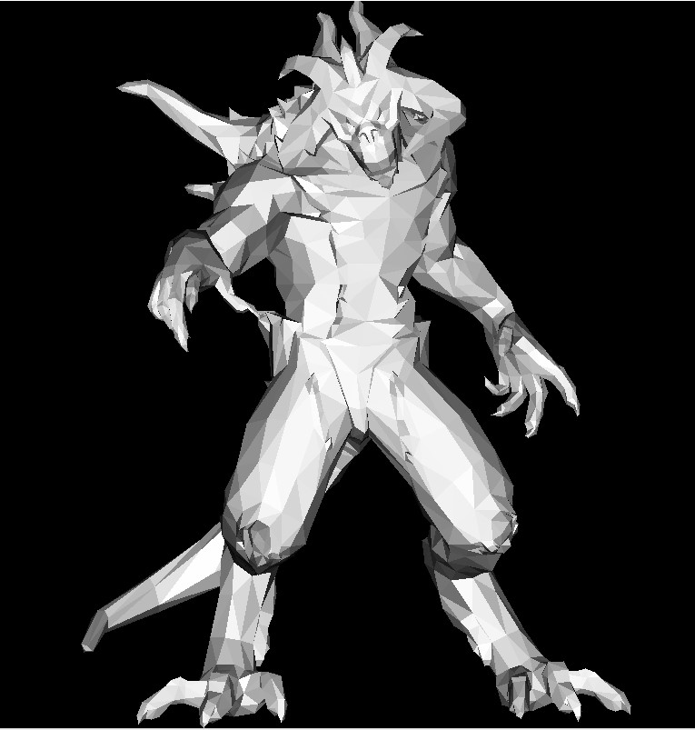
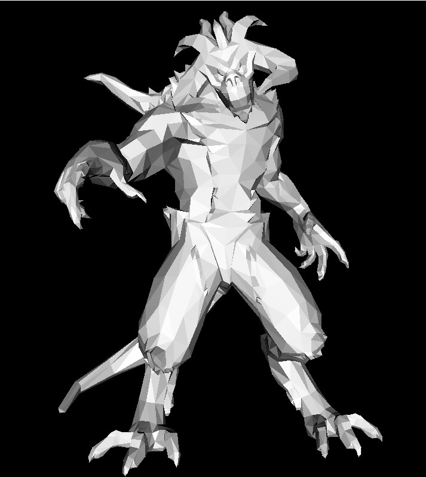

# Nano Renderer
***"What I cannot create, I do not understand"** - R. Feynman*

---

**Nano Renderer** — кроссплатформенный минималистичный софт-рендерер на C++.  

**Цель проекта** — исследовать принципы работы современных графических библиотек и вручную реализовать базовый функционал типичного 3D софта. 

>На данный момент для фокуса на 3D было сделано два исключения в работе со сторонними не графическими библиотеками:
>- Используется готовое решение по записи в TGA файл
>- Для вывода вьюпорта на экран используется SDL3

---

## 🚀 Возможности

-  Загрузка `.obj`  
-  Растеризация триангулированных моделей  
-  Превью во вьюпорте  
-  Экспорт изображения в `.tga`

>#### Планируется
> - Работа с текстурами
> - Изменяемый источник освещения
> - Ambient occlusion
> - Загрузка моделей в других форматах
> - Экспорт изображений в другие форматы


---

## ⚙️ Сборка и установка

### Требования
- **C++20**
- **CMake ≥ 3.21**
- **Интернет-соединение** (для автоматического скачивания SDL3)

### Инструкция

#### Windows / Linux / macOS
```bash
mkdir build
cd build
cmake ..
cmake --build . --config release
```

> После этого в bin\ создастся папка Release в которой появится исполняемый файл и .dll библиотеки.

---


# Демо

## Интерфейс


На иллюстрации указано какую модель вызывают кнопки и примерное количество точек в этой модели.

## Пример работы первой версии

В первой версии проекта, с которой была продолжена разработка, у программы была возможность только вывода с фиксированной камеры.
Результатом работы приложения было сформированное .tga изображение того файла, который лежал в папке с исходником.



## Пример работы актуальной версии

На данный момент у приложения появился вьюпорт, в котором можно изучить модель, а также посмотреть несколько вариантов приложенных .obj файлов.
После закрытия окна вьюпорта также записывается .tga файл, но уже с последней открытой моделью и последним положением камеры.
Модели представлены разных размеров(по количеству точек), чтобы можно было проверить масштабируемость системы.


### Примеры работы приложения на разных этапах
**Отрисовка линий:**



### Заполненные треугольники, упрощенная ортогональная проекция, не просчитывается zbuffer



### Добавлен zbuffer



### Камера реализует перспективную проекцию



---

## 📁Структура проекта

- **src** — исходный код проекта
- **assets** — модели и примеры вывода
- **bin** —  Скомпилированные демонстрационные сборки
- **lib** — Сторонние решения (например, tgaimage)
- **docs** — Документация, более подробно описана математическая библиотека math_core

### Зависимости

 - SDL3 — окно вьюпорта
 - tgaimage — запись .tga файлов
> Все сторонние библиотеки автоматически подгружаются через CMake при первой сборке.

---

## Вспомогательные материалы

- [Подробный курс статей о работе 3D графики](https://haqr.eu/)
- [Веб книга по OpenGL, покрывает много теории](https://learnopengl.com/)
- [Туториалы по SDL](https://lazyfoo.net/tutorials/SDL/index.php)
- [Вводный курс по базовой линейной алгебре 3Blue1Brown](https://youtube.com/playlist?list=PLZHQObOWTQDPD3MizzM2xVFitgF8hE_ab&si=Kx5wlbKsYD5zDGR0)
